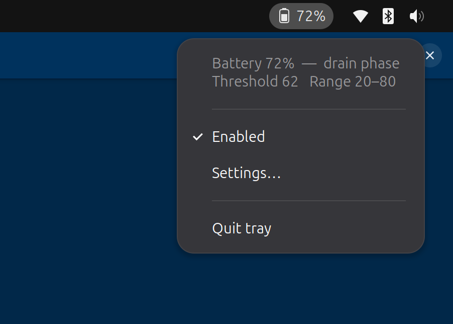

# battery-manager

A small Linux daemon and GTK tray applet that caps your laptop battery
charge at a configurable percent (default 80%) for better battery
longevity. Targets ASUS laptops on Ubuntu/GNOME, but works on any
hardware that exposes `charge_control_end_threshold` in sysfs and any
desktop that supports AppIndicator tray icons.

Built and tested on Ubuntu + GNOME + ASUS ProArt P16 H7606WV.

<!-- Drop a screenshot at assets/screenshot-tray.png and the image below will render. -->


## Why

Holding a Li-ion battery at 100% for long stretches dramatically
shortens its lifespan. Calendar aging at 100% State of Charge runs
roughly 3-5× faster than at 80%. Most laptop vendors expose a "charge
cap" setting in their proprietary Windows tools (ASUS Battery Health,
Lenovo Vantage, etc.); on Linux this needs a small userspace daemon to
keep the kernel's `charge_control_end_threshold` set, plus a tray UI
so you can toggle and tune it without reading the wiki.

This project provides both. It also handles two ASUS-specific firmware
quirks invisibly:

  1. The firmware stops charging slightly *before* the written
     threshold (top-out around `threshold − 0.5%`), so writing 80
     actually caps at 79. We write `high + 1` internally so the
     displayed value matches what you asked for.
  2. After hitting the cap once, the firmware latches into a "stopped"
     state and won't resume charging just because the threshold is
     raised. We briefly write 100 first, poll until the firmware
     re-enters charging, then write the real target.

## Features

  - Single-knob configuration: just the charge cap (`high`)
  - Stable cap that holds the *displayed* value, not 1% below
  - Self-corrects when firmware resets the threshold (e.g., on AC events)
  - System tray applet (GTK 3 + AppIndicator):
      - colored icon per state — green/charging, orange/holding,
        blue/on-battery, gray/disabled
      - plain-English status text in the menu
      - one-click enable/disable
      - small settings dialog for the cap
  - Desktop notifications on state transitions
  - Polkit rule so the tray controls the service without password prompts
  - Autostarts at login
  - Zero pip dependencies — stdlib + system GTK bindings

## Requirements

  - Linux with `charge_control_end_threshold` exposed (kernel ≥ 5.4 on
    most ASUS laptops)
  - Python ≥ 3.11 (for `tomllib`)
  - `python3-gi`, `gir1.2-gtk-3.0`, `gir1.2-ayatanaappindicator3-0.1`
    (installed automatically by `install.sh` on Debian/Ubuntu, or pulled
    in by the `.deb` as Depends)
  - A desktop environment that renders AppIndicator tray icons. On
    GNOME, install the
    [AppIndicator extension](https://extensions.gnome.org/extension/615/appindicator-support/)
    (default on Ubuntu). The
    [Just Perfection extension](https://extensions.gnome.org/extension/3843/just-perfection/)
    has a toggle to hide the system battery icon if you don't want
    two battery indicators in your panel.

## Install

Two options.

### Option A — `.deb` package (recommended for end users)

Download the `.deb` from the latest
[release](https://github.com/rapsalands/battery-manager/releases), or
build it locally with `./packaging/build-deb.sh`. Then:

```sh
sudo apt install ./battery-manager_<version>_all.deb
```

apt resolves the GTK / AppIndicator / systemd dependencies. The
package installs to `/opt/battery-manager/`, drops a systemd unit, a
polkit rule, and a system-wide autostart entry; the daemon starts
immediately and the tray launches on next login.

Remove with `sudo apt remove battery-manager` (or `apt purge` to also
reset the battery threshold to 100).

### Option B — source install

```sh
git clone https://github.com/rapsalands/battery-manager.git
cd battery-manager
./install.sh
```

The installer detects a compatible battery, apt-installs any missing
typelibs, creates a `venv/` with `--system-site-packages`, installs and
starts a systemd service, installs a polkit rule, and launches the tray.

## Configuration

Edit `config.toml` (project folder for source install,
`/opt/battery-manager/config.toml` for `.deb` install) and restart:

```sh
sudo systemctl restart battery-manager.service
```

```toml
high = 80           # cap %. 80 is recommended. 60 is more aggressive.
poll_seconds = 30   # how often the daemon re-asserts the threshold
battery = ""        # empty = auto-detect; or set e.g. "BAT0"
notify_user = ""    # populated by install.sh; empty disables notifications
```

You can also change the cap from the tray Settings dialog without
editing the file.

## How it works

```
┌─ system (root) ──────────────┐    ┌─ user ─────────────────────────┐
│  battery_manager.py (daemon) │◀───│  battery_tray.py (GTK)         │
│  reads sysfs                 │    │  reads sysfs + config.toml     │
│  writes charge threshold     │    │  writes config.toml on Apply   │
│  reads config.toml           │    │  controls service via polkit   │
└──────────────────────────────┘    └────────────────────────────────┘
```

  - `battery_manager.py` runs as a root systemd service. Every poll it
    reads capacity / status / current threshold and re-writes
    `charge_control_end_threshold` to `high + 1` (with the firmware
    kick when necessary). Fires desktop notifications on Charging /
    Not-charging / Discharging transitions.
  - `battery_tray.py` runs as your user. Polls sysfs and config.toml
    every two seconds, drives the AppIndicator icon and menu, writes
    config.toml when you Apply settings, and calls
    `systemctl start/stop/restart battery-manager.service` (allowed
    without a password thanks to the polkit rule installed by
    `install.sh` or the `.deb` postinst).

## Inspect

```sh
systemctl status battery-manager.service
journalctl -u battery-manager.service -f
cat /sys/class/power_supply/BAT*/{capacity,status,charge_control_end_threshold}
```

## Uninstall

Source install: `./uninstall.sh`. `.deb` install: `sudo apt remove
battery-manager` (or `purge` to reset threshold to 100 as well).

## Caveats

  - This is not magic — Li-ion still degrades over time. The win from
    capping at 80% vs 100% is roughly 2-3× longer time-to-noticeable
    capacity loss, not perpetual youth.
  - There is no firmware command to *force* a battery to discharge
    while AC is connected. The daemon only gates charging. If you stay
    plugged in 24/7, the battery effectively holds near 80% forever
    (this is the optimal state for it).
  - GNOME does not render AppIndicator tray icons natively; you need
    the AppIndicator extension (default on Ubuntu, manual install on
    other GNOME distros).
  - Tested on the ASUS ProArt P16 H7606WV. The firmware quirk fixes
    (cap+1, kick to resume) are designed for ASUS hardware; on
    machines exposing different sysfs semantics they may be unnecessary
    or counter-productive.

## License

MIT — see [LICENSE](LICENSE).
